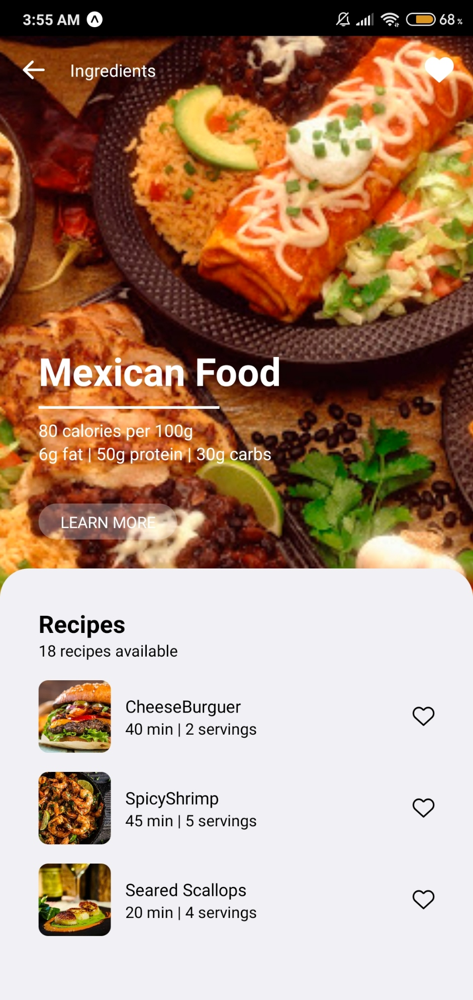

<div align="center">
    <h1>Recipe App</h1>
    </img>
</div>

## 🚀 Technologies
- React Native
- Expo
- Styled Components

## 🔧 How to use ?
```bash
# Install node_modules with
$ Yarn add or Npm start
# Start The Project
$ Yarn init, Npm init or Expo start
```